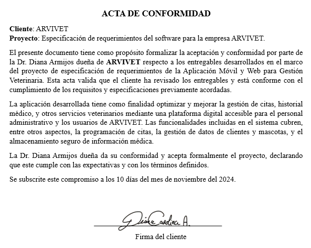

# ARVIVET System Documentation

This Repository contains the resources used in the creation of the software requirements specification for the first project of the subject Software Engineering 1. This resources include  prototypes for the app, evidences of the testing fase with the low fidelity prototype and other resourses used in the elaboration of this project.

## Content

- [Problem Statement](#problem-statement)
- [Importance of the App](#importance-of-the-app)
- [Evidence of Lifting the Requirements](./Image_validations_screens/Validations)
- [Mobile App Prototype](./Proyecto_imagenes/Screens/Mobile)
- [Web App Prototype](./Proyecto_imagenes/Screens/Web)
- [Acceptance Letter](#Acceptance-Letter)

---

### Problem Statement

At "ARVIVET", a veterinary center with two branches in Guayaquil, the manual processes of managing appointments and tracking medical records are leading to inefficiencies and operational challenges. This situation creates several issues, such as overlapping appointments, missed follow-ups, and delays in communication between the staff and customers. These inefficiencies can negatively impact customer satisfaction and the overall quality of veterinary care, as well as hinder the center’s ability to grow and improve its services. Our counterpart will be Dr. Diana Armijos, owner of the center and main veterinarian.

### Importance of the App

The proposed application is crucial because it will transform how veterinary services are managed at "ARVIVET". By digitizing appointment management, automating notifications, and centralizing medical records, the app will enable smoother, more efficient interaction between the clinic and its clients. This is especially important in a fast-paced environment where time management and effective communication are key to delivering high-quality care. The app ensures that clients have an easy and accessible way to interact with the veterinary staff, helping reduce errors, minimize delays, and improve overall customer experience.

## Acceptance Letter

## Group Members
- Noelia Alejandra Saltos Hernandez
- Dafne Thayz Ruiz Capuz
- Johnny Santiago Rodriguez Salinas
- Jahir Alexander Díaz Cedeño

